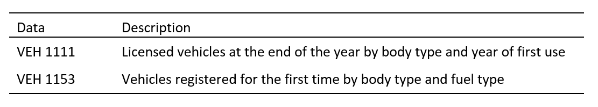

# UCL ESDA dissertation: Vehicle Stock Model
This is a data analysis that I conducted as part of my MSc dissertation in Energy Systems and Data Analytics at University College London (UCL).
 
## Description
One of the analyses that the dissertation needs to address is the projection of vehicle stock. The aim is to estimate the number of newly registered and retired vehicles until 2050 using a vehicle stock model. This analysis will incorporate projected diffusion rates to forecast the number of AVs. Although AVs are not yet widely available in the UK, it is probable that they will partially replace other vehicles. Hence, this analysis is essential for a more precise forecast as the lifespan of a vehicle is a crucial determinant of its stock.

## Data
The data for vehicle stock models is obtained from the vehicle licensing statistics data tables collected by the Driver and Vehicle Licensing Agency (DVLA). These tables offer historical statistics on licensed vehicles in the UK and provide detailed breakdowns by various vehicle aspects, including body type, fuel type, year, and year of introduction. For this analysis, the following breakdown datasets will be utilised.

